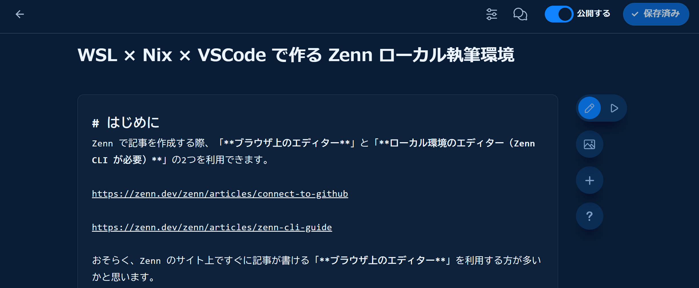
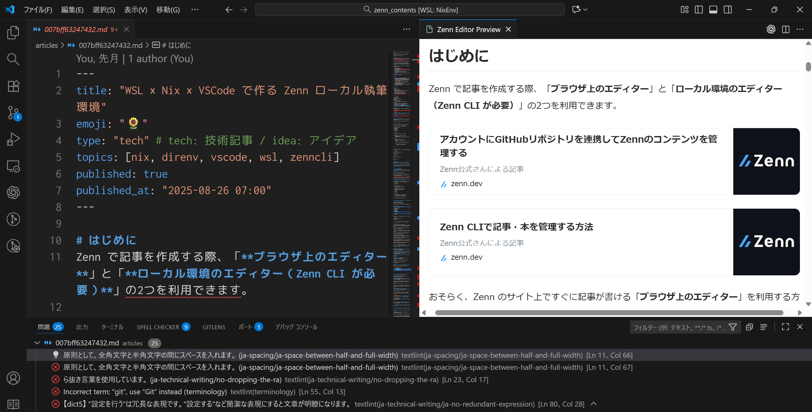
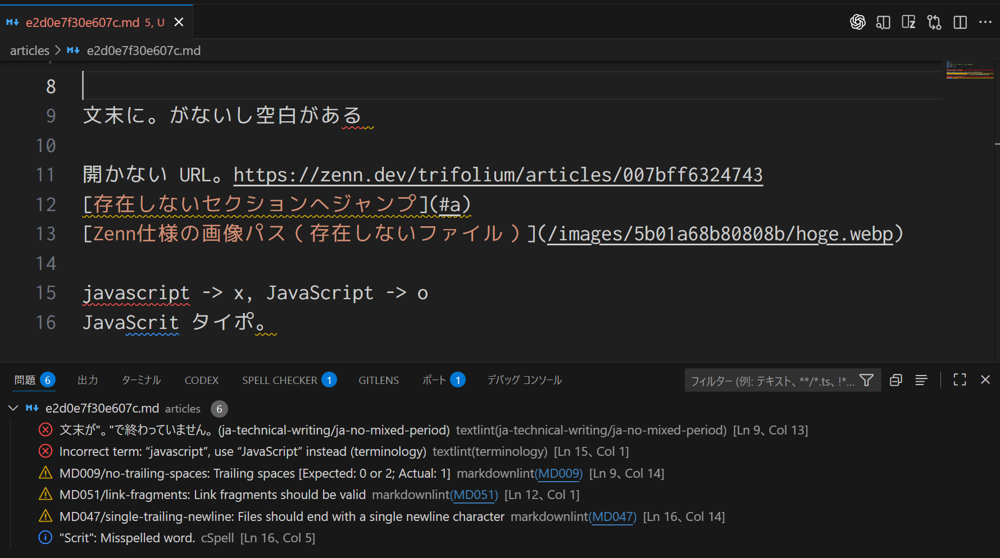

<!--
headingDivider: 1
-->

# Nix で作る Zenn 執筆環境
#### ~Nix を使い始めたきっかけ・試行錯誤した事~

ryu
2025/10/18
Nix meetup #4 [Nix日本語コミュニティ]


# 自己紹介: ryu

<!--
header: "Nix meetup #4 [Nix日本語コミュニティ]"
footer: "2025/10/18 ryu(@ryu_trifolium)"
paginate: true
-->

- バックグラウンド:
  - 非 IT 系企業の社内 SE
  - エンジニア歴 1 年
  - C#/Python/Docker/Terraform
  - Azure/Snowflake/RPA
- Nix 歴: 3 か月（2025/7～）
- GItHub: ryuryu333
- Zenn: trifolium


# 今日話すこと
<!--
_class: lead
-->

- **Nix を使い始めたきっかけ**
- **Nix で作成した Zenn 執筆環境の紹介**


# 今日話すこと
<!--
_class: lead
-->

- **＞Nix を使い始めたきっかけ**
- Nix で作成した Zenn 執筆環境の紹介


# テックブログ 書いていますか？
<!--
_class: lead
-->


# 私は Zenn で記事を書いています
<!--
_class: lead
-->


<small>

>Zenn メディアキット https://zenn.dev/mediakit

</small>

# ブラウザ（Zenn）での記事作成画面



# ローカルエディタも利用可能！！
<!--
_class: lead
-->


# ブラウザでの記事執筆と比べると...

- Git 管理できる
- 好きなエディタが使える（e.g. VSCode, Vim, etc.）
- Linter が利用可能
- その他カスタマイズの可能性は無限大


>cf. Zennの2種類の執筆方法について（Zenn 公式）
>https://zenn.dev/zenn/articles/editor-guide


# VSCode での作成画面



# ローカル環境で書くために...

## Node.js のパッケージである Zenn CLI が必要

```
npm install zenn-cli
```


# 🤔

<!--
_class: lead
-->

## ローカル PC に Zenn でしか使わない
## Node.js パッケージを入れるのは嫌だな...


# 😁

<!--
_class: lead
-->

## Docker で Zenn 専用の環境を作るぞ

### ↓ 実際に作ってみた
Dev Containers で始める快適 Zenn 執筆環境
https://zenn.dev/trifolium/articles/5e7cd43586b68a


# 🤔

<!--
_class: lead
-->

## わざわざコンテナを作成するのは非効率では？

- コンテナ内で Git を使うのですら一苦労
- ホスト PC（Winodws） -> WSL（Ubuntu） -> Docker Container
-> GUI はホスト PC の VSCode
経路が複雑でエラー調査が大変だった

### Zenn CLI を隔離したい
### でも Git などはホスト側を使って楽がしたい


# 😁

<!--
_class: lead
-->

## Nix の devShell というのが便利らしい...

### ↓ 実際に使ってみた

WSL × Nix × VSCode で作る Zenn ローカル執筆環境
https://zenn.dev/trifolium/articles/007bff63247432

https://github.com/ryuryu333/zenn_contents_nix_env_template


# 今日話すこと
<!--
_class: lead
-->

- Nix を使い始めたきっかけ
- **＞Nix で作成した Zenn 執筆環境の紹介**


# 作成した Zenn 執筆環境の特徴

- 🧱 devShell：git などは WSL 側のものをそのまま使用
- 🧊 direnv：devShell を自動起動
- 📦 Node.js 24 固定 + lockfile から `node_modules` 構築
- 🧭 go-task で作業簡略化：`lint` / `update` / `install` / `uninstall`
- 🧰 VSCode task：フォルダを開くと `zenn preview` 自動実行
- ✅ treefmt で Linter 一括実行：markdownlint・textlint・cspell...


#
## 色々と書きましたが
## メジャーなツールを組み合わせているだけです
## ↓
## Nix 関連を中心に紹介していきます

<!--
_class: lead
-->


# devShell
- 開発用のシェル環境を作成
- 環境外の既存ツールを利用可能（便利！）
- 今回は Zenn 執筆用 + Node パッケージ管理用の 2 環境を用意


# devShell

```
# flake.nix
devShells.default = pkgs.mkShell {
  packages = [pkgs.zenn-cli];
};
```

```
$ zenn --help
zenn: command not found

# devShell を起動すると zenn コマンドが利用可能になる
$ nix develop
$ which zenn
/nix/store/g3311a4zplf96vmmp3ygia615y52lsln-zenn-cli-env-node-modules-1.0.0/node_modules/.bin/zenn

# devShell 外のツールも使える
$ which git
/home/ryu/.nix-profile/bin/git
```


# 🤔

<!--
_class: lead
-->

## 毎回 `nix develop` を実行するのは面倒だな...


# direnv・nix-direnv
- direnv
  - ディレクトリごとに自動で環境変数やシェル環境を切り替える
- nix-direnv
  - devShell を自動起動する（direnv が必要）

>https://direnv.net/
>https://github.com/nix-community/nix-direnv


# 🤔

<!--
_class: lead
-->

## `git` や `direnv` も Nix で管理したいな...
## 毎回 `flake.nix` に書くのも面倒だな...


# home-manager
- Nix を用いてユーザーのホーム環境を管理する
（設定ファイル・ツール構成など）
- Git や direnv など汎用的に利用するツールを管理

>https://github.com/nix-community/home-manager

><small>書いた記事：
WSL x home-manager で dotfiles を管理する - 4手法の比較と使用方法 - </small>
>https://zenn.dev/trifolium/articles/642043cbae5f21


# home-manager
```
{ config, pkgs, ... }:
{
  home.packages = with pkgs; [
    git
    bash
    direnv
    nix-direnv
  ];
  home.file = {
    ".gitconfig".source = git/.gitconfig;
    ".bashrc".source = bash/.bashrc;
    ".profile".source = bash/.profile;
  };
}
```


# Nixpkgs
- Nix で利用可能なパッケージの大規模コレクション
- 大抵のツールはここに登録されている
  - Zenn-CLI も登録済み！！
- NixOS Search - Packages で検索すると楽
  - https://search.nixos.org/packages

>https://github.com/NixOS/nixpkgs

# 🤔

<!--
_class: lead
-->

## Nixpkgs に無い場合はどうするんだ...？
### 今回だと、一部の Node.js パッケージが無かった😭
e.g. textlint のルールプリセット


# importNpmLock
- `importNpmLock.buildNodeModules`:
 package-lock.json から node-modules を構築
- `importNpmLock.hooks.linkNodeModulesHook`:
プロジェクトルートに node_modules のシンボリックリンクを作成

```
$ ls
flake.nix node_modules ...

$ ls -l node_modules | grep "zenn-cli ->"
zenn-cli -> /nix/store/g3311a4zplf96vmmp3ygia615y52lsln-zenn-cli-env-node-modules-1.0.0/node_modules/zenn-cli
```

>https://github.com/NixOS/nixpkgs/tree/master/pkgs/build-support/node/import-npm-lock


# importNpmLock

```
# flake.nix
devShells.default = pkgs.mkShell {
  packages = [
    importNpmLock.hooks.linkNodeModulesHook
  ];
  npmDeps = importNpmLock.buildNodeModules {
    inherit npmRoot nodejs;
  };
};
```


# node modules を再現するまでの流れ
- npm を利用して package.json、package-lock.json を更新
  - npm を利用するための devShell を定義しました
  - `nix develop .#node -c npm install -D zenn-cli --package-lock-only`
- `nix develop`
- node_modules が構築される
- （不定期）nuc を利用してパッケージの更新チェック
  - `nix develop .#node -c ncu -u`


# 参考資料

NixOS レポジトリの `languages-frameworks/javascript.section.md`
に言語ごとのガイドがある

https://github.com/NixOS/nixpkgs/blob/master/doc%2Flanguages-frameworks%2Fjavascript.section.md#javascript-language-javascript


# 
<!--
_class: lead
-->

## 細かい解説はこちらの記事に書きました

>node2nix で Nixpkgs 非登録の Node ライブラリを管理する
>https://zenn.dev/trifolium/articles/32ff89d4e14815

>Nix × Node.js 環境構築
>https://zenn.dev/trifolium/articles/6678b0c0fb0d27


# 🤔

<!--
_class: lead
-->

## Node.js パッケージの更新管理
## 毎回、長いコマンドを打つのは面倒...
`nix develop .#node -c npm install -D zenn-cli --package-lock-only`

## 更新の度に devShell を再起動するのも面倒...
`direnv reload`


# go-task
- タスクランナー、長いコマンドを簡潔なコマンドで実行する
  - As-is:
  `nix develop .#node -c npm install -D zenn-cli --package-lock-only`
  `direnv reload`
  - To-be:
  `task install --zenn-cli`

>https://github.com/go-task/task


# 作ったタスク

```
$ task
task: Available tasks for this project:
* check:                      -> node:update:check
* install:                    -> node:install & utl:reload      (aliases: add)
* lint:                       -> utl:lint
* reload:                     -> utl:reload                       (aliases: re)
* uninstall:                  -> node:uninstall & utl:reload      (aliases: remove, rm)
* update:                     -> node:update & utl:reload         (aliases: up)
* node:install:               Add package to package.json and package-lock.json (requires args e.g. <PackageName>@<Version>)
* node:uninstall:             Remove package from package.json and package-lock.json (requires args e.g. <PackageName>)
* node:update:                Update packages and refresh package-lock.json
* node:update:check:          Check for outdated packages
* node:update:lockfile:       Refresh package-lock.json from package.json
* node:update:packages:       Update packages to the latest version (only package.json)
* utl:lint:                   Run linters
* utl:reload:                 Reload Nix devShell environment
```


# ここからは Nix と無関係なツールです

<!--
_class: lead
-->


# 🤔

<!--
_class: lead
-->

## ブラウザでのプレビューの度に
## `zenn preview` を実行するのは面倒...


# VSCode task
  - VSCode のタスク機能を利用して、ディレクトリを開く際に
  `zenn preview` を自動実行
  - ※ブラウザでプレビューするのに実行が必要


# 🤔

<!--
_class: lead
-->

## せっかくだから Linter を用意したい...
## 良い感じにリアルタイム検出してほしい...


# Linter
- markdownlint（Markdown の文法チェック）
- textlint（日本語の文書校正）
<small>

  - textlint-filter-rule-comments（リンターでチェックしない領域を指定）
  - textlint-rule-preset-ja-spacing（日本語周りにおけるスペースの有無を指定）
  - textlint-rule-preset-ja-technical-writing（技術文書向けのルールプリセット）
  - textlint-rule-terminology（英語の技術文書内の用語のスペルをチェック）

</small>
- cspell（スペルミスの検出）
- lychee（URL リンク切れチェック）


# 



# 🤔

<!--
_class: lead
-->

## CLI で Linter を実行するのが手間だな...
## Linter の種類多すぎ

# treefmt
- リンター・フォーマッターを一括実行する

```
[formatter.md]
command = "markdownlint-cli2"
options = ["--config", "linter/.markdownlint-cli2.jsonc"] 
includes = ["articles/*.md"]
priority = 1

[global]
excludes = ["articles/00341ed49b7935.md", ...]
```

>https://github.com/numtide/treefmt


# 
<!--
_class: lead
-->

## 各リンターの紹介・Zenn 用の設定など
## こちらの記事にまとめています
Zenn 執筆用リンターを整備する - treefmt で一括実行
https://zenn.dev/trifolium/articles/5b01a68b80808b


# 今日話したこと
<!--
_class: lead
-->

- **Nix を使い始めたきっかけ**
- **Nix で作成した Zenn 執筆環境の紹介**


# 作成した Zenn 執筆環境の特徴（再掲）

- 🧱 devShell：git などは WSL 側のものをそのまま使用
- 🧊 direnv：devShell を自動起動
- 📦 Node.js 24 固定 + lockfile から `node_modules` 構築
- 🧭 go-task で作業簡略化：`lint` / `update` / `install` / `uninstall`
- 🧰 VSCode task：フォルダを開くと `zenn preview` 自動実行
- ✅ treefmt で Linter 一括実行：markdownlint・textlint・cspell...

https://zenn.dev/trifolium/articles/007bff63247432
https://github.com/ryuryu333/zenn_contents_nix_env_template


# ご清聴ありがとうございました
<!--
_class: lead
-->
