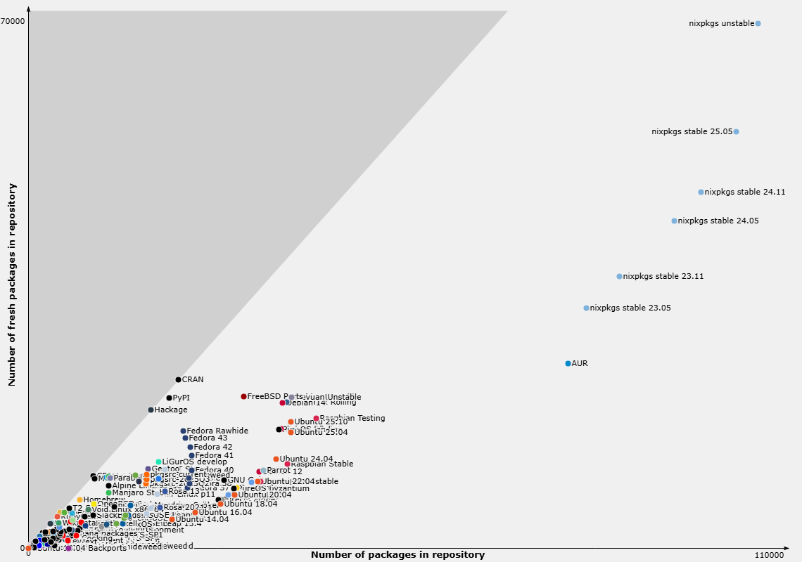

<!--
headingDivider: 1
-->

# 再現性の高い Python 開発環境を作る
#### Python ライブラリは uv / その他ツールは Nix で固定する

ryu
2025/11/20
堅牢.py #1 [Kenro.dev]


# 自己紹介: ryu

<!--
header: "堅牢.py #1 [Kenro.dev]"
footer: "2025/11/20 ryu(@ryu_trifolium)"
paginate: true
-->

- バックグラウンド:
  - 非 IT 系企業の社内 SE
  - エンジニア歴 1 年
  - C#/Python/VBA
  - Terraform/Azure/Snowflake
  - Docker/Nix
- GitHub: ryuryu333
- Zenn: trifolium


# 堅牢な Python プログラムを作るには

- 型ヒント
  - typing（Python 標準ライブラリ）
- 静的解析
  - Ruff（リンター）、Mypy、Pyright（型チェッカー）
- テスト
  - pytest（単体テスト）、GitHub Actions（CI/CD、自動テスト）
- etc.

### 「コード」の堅牢さは確保できる、これで十分？

# 
<!--
_class: lead
-->
## コードが良くても「環境」がズレると壊れる
## → 開発環境の堅牢さも重要


# uv
- rust 製の Python パッケージマネージャー
  - Python 本体の管理も一応可能
- **ロックファイルによるライブラリの依存関係を固定**
  - `uv sync` でチーム全員が同じライブラリ環境を手軽に再現できる
- pip と比べ 10～100 倍高速

### Python ライブラリの再現性を確保しやすくなった
## 🤔 これで十分？


# Python の外側
- uv 本体のバージョン
- Python 本体のバージョン
- uv が対応していない各種ツール
  - Node.js ツール、go-task、...

### 再現性のためにはこれら要素も固定化したい


# Docker
- コンテナ型仮想化技術
- OS レベルで環境を分離できる
  - アプリケーションが依存する OS パッケージやツールごと隔離


|     | Docker   | uv（venv）   |
| :---: | :---: | :---: |
| 分離の対象   | OS レベル<br>（アプリケーション環境全体）   | Python パッケージ   |

# uv x Docker が流行ってきてる（主観）

- DockerHub で uv 用の image が配布されている
  - https://hub.docker.com/r/astral/uv
- 実際の活用例
  - [uv から始まる Python 開発環境構築：zenn 2024/08/28](https://zenn.dev/dena/articles/python_env_with_uv)
  - [uv × DockerでのPython開発環境構築方法：zenn 2025/10/21](https://zenn.dev/mkj/articles/3aaa36d6f35c08)

## 大規模プロジェクト/本番稼働/長期運用に最適


# 個人的に感じてる Docker の課題
- **環境再現性が低い**
  - ビルドしたイメージを使いまわせば確実だが...更新が大変
  - ビルドし直すたびに最新バージョンになる
    - `RUN apt install` する全てをバージョン指定するのは非現実的
  - コンテナ内でツールを手動追加すると再現不能になる
- **Dockerfile の記述コストが高い**
- **PC リソース消費が重い**


# 小〜中規模の開発ではどうするか？
- PoC やちょっとした自動化スクリプト
- Jupyter Notebook でのデータ解析

#### 環境の更新頻度が高い・迅速さが求められる案件の場合
#### Docker よりも手軽な手段が欲しい
## でも、再現性は確保したい！


# 今日の本題
## ・uv で Python パッケージを管理
## ・Nix で Python 以外のツールを管理
### （uv や Python 本体も Nix で固定）

### 「手軽さ」と「再現性」を両立したい！


# Nix とは何者かを話す前に...
<!--
_class: lead
-->


# uv の特徴 - 宣言的な管理
- **環境で利用する Python ライブラリを宣言的に記述**
- `uv add hoge` で追加
- `uv remove hoge` で削除

```
dependencies = [
    "openpyxl>=3.1.5",
    "pandas>=2.3.3",
]
```

# uv の特徴 - ロックファイル
- **ロックファイルでライブラリの依存関係を固定**
- `uv sync --frozen` で依存を含めてバージョンが再現できる

```
[[package]]
name = "openpyxl"
version = "3.1.5"
source = { registry = "https://pypi.org/simple" }
dependencies = [{ name = "et-xmlfile" },]
sdist = { url = "xxx", hash = "sha256:xxx",
          size = 186464, upload-time = "2024-06-28T14:03:44.161Z"}
wheels = # url hash など
# et-xmlfile など他のライブラリも同様
```


# Nix
- パッケージマネージャー
- **利用するパッケージを宣言的に記述**
- **ロックファイル（`flake.lock`）で依存関係のバージョンを固定** 
- 様々なパッケージが利用可能
  - git、curl、Claude Code、Node.js 製ツール、Python...

# nixpkgs
- 登録パッケージ数が
一番多い
- 約 10 万

>2025/11/14 時点
[Repology](https://repology.org/repositories/graphs) より




# devShell
- Flake：Nix を再現性高く、使いやすくする仕組み
- devSehll：Flake が提供する機能のひとつ

#### ホスト上に「開発用のシェル環境」を一時的に構築する仕組み
#### uv における venv に似てる

# devShell を使うと何が嬉しいのか？
- uv、Python、その他多くのツールを**一括で宣言的に管理**できる
- `flake.nix` 作成 → `nix develop` ですぐに利用できる
  - uv における `pyproject.toml` 作成 → `uv sync` と似てる
- ロックファイル（`flake.lock`）で依存関係のバージョンを固定
  - uv における `uv.lock` と似てる
- Docker と異なり、**ホスト側の設定やツール（git 等）を利用**できる


# 実例

```
# flake.nix で利用したいパッケージを記述
devShells.default = pkgs.mkShell {
  packages = [pkgs.python311, pkgs.uv];
};
```


```bash
$ uv --version # uv はユーザー環境に存在しない状態
Command 'uv' not found

$ nix develop # devShell に入る

$ uv --version # flake.nix で指定した uv が利用可能になる
uv 0.8.23
```

# 実例

```bash
$ which uv # nix により uv のバイナリは nix/store にビルドされる
/nix/store/n6chrdybb91npp8gvf8mjk55smx4sn8s-uv-0.8.23/bin/uv

$ echo "$PATH" | tr ':' '\n' | grep uv # devShell により uv が PATH に登録される
/nix/store/n6chrdybb91npp8gvf8mjk55smx4sn8s-uv-0.8.23/bin

$ which openssl # ユーザー環境にあるツールも利用可能
/usr/bin/openssl

$ exit # devShell を抜ける

$ uv --version
Command 'uv' not found
```


# devShell では実現できないこと
- OS レベルの環境統一
  - devShell はあくまで「ホスト上で動く開発用シェル」
  - OS カーネルの差異は吸収できない
- 実行環境の分離
  - ホスト側の設定、ファイルにアクセスできてしまう
  - 隔離するオプションはあるが、設定が煩雑...

#### 実行環境を完全に統一したい場合、Docker を使うべき


# Nix の使いどころ
- **開発に使うツールの統一・再現**
- **軽量で柔軟な環境**
  - Docker よりも設定が楽、動作負荷が軽い
  - ホスト側のツールや設定も活用可能

#### PoC、データ解析、小～中規模開発は Nix x uv
#### 本番環境、大規模開発は Docker x uv
>個人的には Docker x Nix x uv に可能性を感じていたりします...


# ここからは補足資料です
<!--
_class: lead
-->
### Nix の簡単な原理解説
### Nix を使ってみたい方向けの参考資料


# 注意
<!--
_class: lead
-->
### Nix には様々な機能があります
### 本セッションでは Nix Flake devShell
### という一機能にフォーカスして紹介します
※ devShell : 開発用の専用のシェルを作る機能

# Nix の特徴 - 宣言的な管理
- **環境で利用するパッケージを宣言的に記述**
- uv と似た書き方っぽい雰囲気

```
devShells.default = pkgs.mkShell {
  packages = [
    pkgs.python311
    pkgs.uv
  ];
};
```

# Nix の特徴 - ロックファイル
- uv はライブラリごとに hash 等を保管していた
- Nix では GitHub レポジトリのコミット位置（Revision）を保管

```
"nixpkgs": {
  "locked": {
    "lastModified": 1762943920,
    "narHash": "sha256-g/da4FzvckvbiZT075Sb1/YDNDr+tGQgh4N8i5ceYMg=",
    "owner": "nixos",
    "repo": "nixpkgs",
    "rev": "e1ebeec86b771e9d387dd02d82ffdc77ac753abc",
    "type": "github"
  },
```

# nixpkgs における uv のビルド定義
コミットを固定 = ビルド手順が固定 = バージョンが固定される
<small><small>サンプル https://github.com/NixOS/nixpkgs/blob/master/pkgs/by-name/uv/uv/package.nix
</small></small>
```
rustPlatform.buildRustPackage (finalAttrs: {
  pname = "uv";
  version = "0.9.7";
  src = fetchFromGitHub {
    owner = "astral-sh";
    repo = "uv";
    tag = finalAttrs.version;
    hash = "sha256-I0Oe6vaH7iQh+Ubp5RIk8Ol6Ni7OPu8HKX0fqLdewyk=";
  };
  cargoHash = "sha256-K/RP7EA0VAAI8TGx+VwfKPmyT6+x4p3kekuoMZ0/egc=";})
```


# Nix のビルドの流れ
1. `flake.nix` に uv を利用すると記述し、`nix develop` を実行
2. `flake.lock` が生成される
どの GitHub レポジトリのコミットを参照するか固定される
3. **GitHub レポジトリから uv の構築方法を取得する**
4. **構築方法に従って uv をビルド**
5. ビルド産物が `/nix/store/xxxx-uv-0.8.23` に保存される
6. 環境変数 PATH に `/nix/store/xxxx-uv-0.8.23/bin/uv` を追加した
シェルを構築し、シェルに入る


# 参考 - 自分が作った Nix 環境
- [nix_uv_experiments](https://github.com/ryuryu333/nix_uv_experiments)
  - Python と uv に加え、ollama を Nix で管理
  - ollama でローカル LLM を動かす
  - Open AI Agent SDK で LLM とターミナルで会話
- [zenn_contents_nix_env_template](https://github.com/ryuryu333/zenn_contents_nix_env_template)
  - go-task、Node.js ツール（Cspell、Zenn-CLI 等）を Nix で管理
  - 普段使いしている Zenn 執筆用の環境
  - <small>[WSL × Nix × VSCode で作る Zenn ローカル執筆環境：Zenn 2025/08/26](https://zenn.dev/trifolium/articles/007bff63247432)</small>

# 参考 - 入門したい人へ
<small>

- まずはこれを読む（初学者向け）：[Zenn Nix入門](https://zenn.dev/asa1984/books/nix-introduction) 、[Zenn Nix入門: ハンズオン編](https://zenn.dev/asa1984/books/nix-hands-on) 
- install 方法 & 簡単な操作解説：[Zero to Nix](https://zero-to-nix.com/start/install/)
- あると便利（個人的には手放せない）
  - [direnv](https://github.com/direnv/direnv)、[nix-direnv](https://github.com/nix-community/nix-direnv)
    - フォルダを開いたら自動で devShell を起動
  - [home-manager](https://github.com/nix-community/home-manager)
    - ユーザー環境を Nix で管理、git 等のインストール、dotfiles 設定
- Nix x uv の記事：[Nixとuvで磨くPython開発環境の再現性：zenn 2025/08/09](https://zenn.dev/shundeveloper/articles/36307d821d40f7)

</small>

# ご清聴ありがとうございました
<!--
_class: lead
-->
