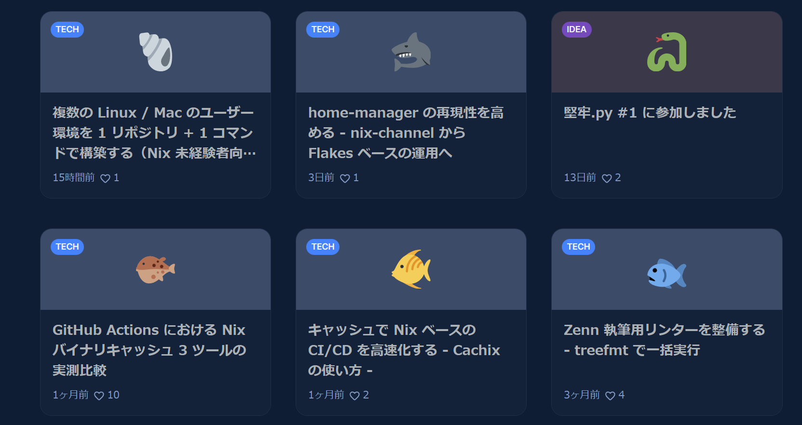
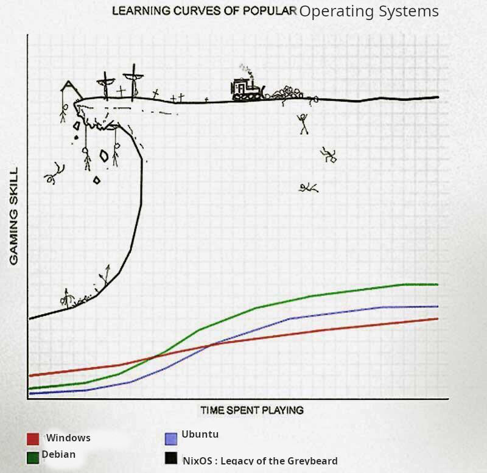
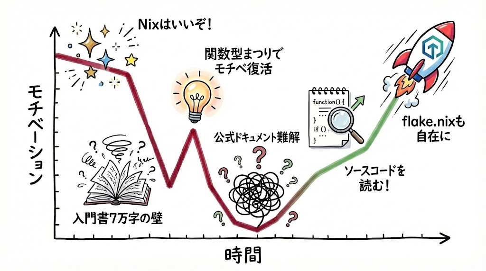
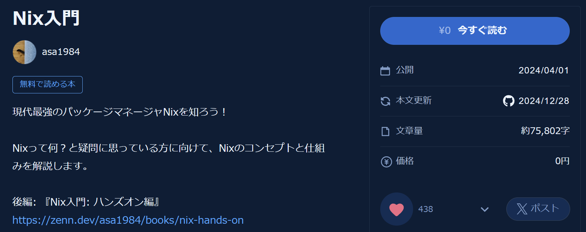
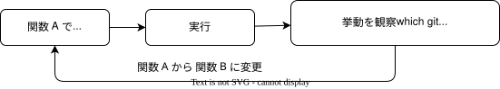
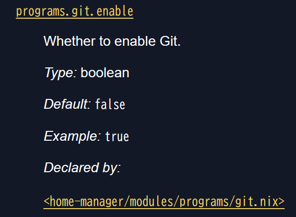
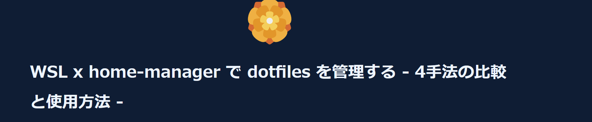

<!--
headingDivider: 1
-->
#
## 新しいツール Nix に挑戦して
## 挫折 & 立ち直った過程を振り返る

ryu
2025/12/9
埼京.dev #1 [埼京.dev]


# 自己紹介: ryu

<!--
header: "埼京.dev #1 [埼京.dev]"
footer: "2025/11/20 ryu(@ryu_trifolium)"
paginate: true
-->

- バックグラウンド:
  - 非 IT 系企業の社内 SE
  - エンジニア歴 1 年
  - Nix が好き
- GitHub: ryuryu333
- Zenn: trifolium


# 今年から Nix を使い始めました
- 今年書いた Zenn 記事の 3 割が Nix（8 / 27）
- 仕事の開発環境、ユーザー環境も Nix 管理




# Nix
- パッケージマネージャー
- **学習曲線が急なことで有名（？）**
- 純粋関数型言語
で設定を記述する
  - クレイジー

<small><small>


[Nix コミュニティ](https://discourse.nixos.org/t/probably-the-best-lecture-of-nix-fundamentals-on-the-internet/9893)にあったネタ画像  →

</small></small>




#
### Nix に慣れるまで




# 
## 今年春頃 - [入門書](https://zenn.dev/asa1984/books/nix-introduction)の文量にノックアウト
友人 「Nix はいいぞ！」
自分 「へー、勉強してみよ... 7 万文字!?」　→　興味 < 面倒さ となる




# 6 月頃 - 関数型言語に興味を持つ
ノリと勢いで [関数型まつり2025](https://fortee.jp/2025fp-matsuri) に参加
純粋関数・宣言的記述といった概念が自分の思想に近いと感じた


# 
<!--
_class: lead
-->
## そういえば、Nix って関数型言語って
## 書かれていたような...
## ↓
## モチベーション復活

# Nix 言語の難しさにノックアウト

- 調べても情報が少ない
- 日本語文献皆無
- 公式ドキュメントは難解

### `flake.nix`（設定ファイル）をコピペはできても
### 自分好みに「カスタマイズ」できない


#
<!--
_class: lead
-->
## Nix、便利だけどよく分からん...
## dotfiles の管理も Nix でできるらしい
## ↓
## 取り敢えず使ってみよう


# home-manager を使い始める
### 案の定、公式ドキュメントを読んでもよく分からない
#### → 関数を一つずつ動かして挙動を詳細に観察してみる




# リファレンスを見てみる
`home.programs.git` 関数の詳細（オプションなど）を知りたい
　→　公式リファレンスを確認、ソースコードっぽいリンクがある




# ソースコードを見てみる
文法はともかく、意味は何となく掴めるコードだった
　→ **この頃から段々と Nix への抵抗感が消えてきていた（不思議）**

```nix
  options = {
    programs.git = {
      ...
      userName = mkOption {
        type = types.nullOr types.str;
        default = null;
        description = "Default user name to use.";
      };
      ...
```

# この学習過程は記事にしました



https://zenn.dev/trifolium/articles/642043cbae5f21


#
<!--
_class: lead
-->
## Nix、完全に理解した
## ↓
## flake.nix のカスタマイズに再挑戦

#
## `flake.nix` で node2nix を使ってみる
node.js 製ツールを Nix で構築したかったのだが...エラーに直面する

### 😭 リアル 1 週間ずっと格闘、心が折れそうになる

→ 過程は省くが、ソースコードを見ると原因が分かった
#### → Nix はドキュメントに加え、ソースコードも読むべきと学ぶ


#
## `flake.nix` で node2nix を使ってみる
#### 😭メチャクチャ苦労したのに node2nix が古い手法だと知る
（記事にする過程で情報調査をしていたら判明した）

→ **英語文献もちゃんと読む**、という当たり前の教訓を得る

# この学習過程も記事にしています


https://zenn.dev/trifolium/articles/32ff89d4e14815


#
<!--
_class: lead
-->
## Nix、完全に理解した（2 度目）
## ↓
## flake.nix のカスタマイズに再挑戦


# `flake.nix` のカスタマイズをしていく
相変わらず、公式ドキュメントは難解
**網羅的な引数の使い方が記載されていない**、などはざらにある

今までなら挫折していたが...

→ ソースコードを読んでみる
→ 引数、返り値、内部で使っている関数...が分かる！
→ `flake.nix` で自分好みのカスタマイズする方法が見えてくる


# まとめ - 得られた教訓
- 学習初期の辛さを乗り越える原動力は興味関心
  - いろんなイベント・ツールに触れるときっかけになるかも
- 最小構成から試し、挙動を観察して感覚を養う
- 公式ドキュメントは隅々まで読む
  - と同時に過度に信用せず、ソースコードも読む


# ご清聴ありがとうございました
<!--
_class: lead
-->

