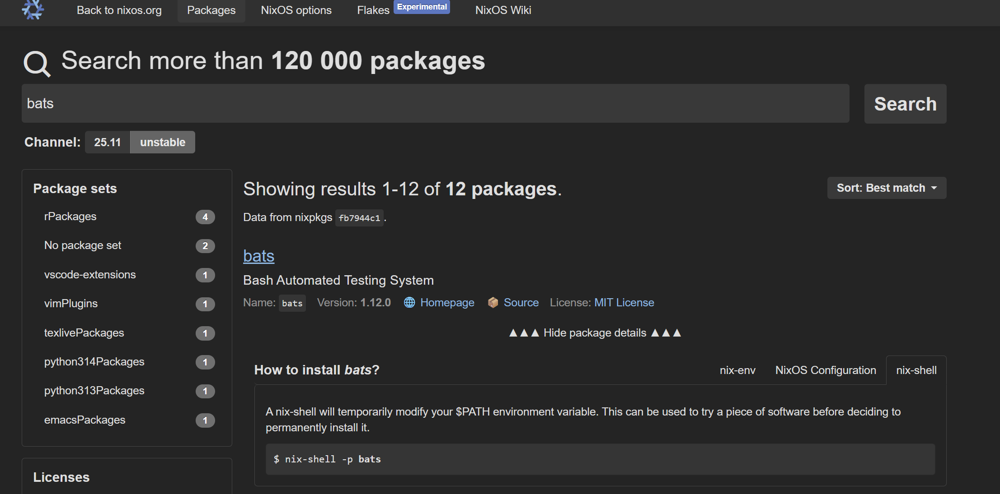

<!--
headingDivider: 1
-->
# nix pkgs のソースコードを探索する
### pkgs.bats.passthru.withLibraries
#### passthru・symlinkJoin・wrapProgram を学ぶ 

ryu
2026/1/9
Nix 日本語コミュニティゼミ


# 自己紹介: ryu

<!--
header: "Nix 日本語コミュニティゼミ"
footer: "2026/1/9 ryu(@ryu_trifolium)"
paginate: true
-->

- バックグラウンド:
  - 非 IT 系企業の社内 SE
  - エンジニア歴 1 年
  - Nix が好き
- GitHub: ryuryu333
- Zenn: trifolium


# ことの始まり
- Bash シェルスクリプト のテストツール Bats を導入した
- ヘルパーライブラリ bats-assert 等だけ見つからない！




# pkgs.Bats のソースコードを見てみる

bats-assert を利用しているコードを発見

```
passthru.tests = { 
  # ...
  bats.withLibraries (p: [
    p.bats-support
    p.bats-assert
    p.bats-file
    p.bats-detik
  ])
  # ...
```

# 使い方を真似てみる
- ビルドが通った！
- シェルスクリプトで load bats-asset も出来た

```
devShells.default = pkgs.mkShell {
    packages = with pkgs; [
        (bats.withLibraries (p: [
            p.bats-assert
            p.bats-support
        ]))
    ];
};
```

# めでたしめでたし？
<!--
_class: lead
-->


# 
## なんでこれで動くのか気になりますよね？
## →ソースコードを読んでみる

リンク：[nixpkgs/pkgs/by-name/ba/bats/package.nix](https://github.com/NixOS/nixpkgs/blob/nixos-unstable/pkgs/by-name/ba/bats/package.nix)


<!--
_class: lead
-->


# bats.withLibraries を探す

<small>

```
  passthru.withLibraries =
    selector:
    symlinkJoin {
      name = "bats-with-libraries-${bats.version}";
      paths = [
        bats
      ]
      ++ selector bats.libraries;
      nativeBuildInputs = [
        makeWrapper
      ];
      postBuild = ''
        wrapProgram "$out/bin/bats" \
          --suffix BATS_LIB_PATH : "$out/share/bats"
      '';
    };
```

</small>


# passthru とは（[リファレンス](https://nixos.org/manual/nixpkgs/stable/#chap-passthru)）

- 関数を定義できる
  - Nix pkgs で慣習的に使われるモノ
    - passthru.tests
    - passthru.updateScript
  - 追加機能を加えるモノ
    - passthru.withPackages 等（e.g. python.withPackages）
- ビルド実行時には無視される
- 中身を書き換えても rebuild されない (passed through される)

# passthru のサンプル

```
{ stdenv, fetchGit }:
let
  hello = stdenv.mkDerivation {
    # src 等...
    passthru = {
      foo = "bar";
      baz = {
        value1 = 4;
        value2 = 5;
      };
    };
  };
in
hello.baz.value1 # result 4
```


# bats.withLibraries

<small>

```
  passthru.withLibraries =
    selector:
    symlinkJoin {
      name = "bats-with-libraries-${bats.version}";
      paths = [
        bats
      ]
      ++ selector bats.libraries;
      nativeBuildInputs = [
        makeWrapper
      ];
      postBuild = ''
        wrapProgram "$out/bin/bats" \
          --suffix BATS_LIB_PATH : "$out/share/bats"
      '';
    };
```

</small>


# symlinkJoin とは（[リファレンス](https://nixos.org/manual/nixpkgs/stable/#trivial-builder-symlinkJoin)）

- 複数の derivation を一つの derivation に配置
- paths にリストしたパッケージへの symlinks を作成


# symlinkJoin のサンプル

```
symlinkJoin {
  name = "myexample";
  paths = [
    pkgs.hello
    pkgs.stack
  ];
  postBuild = "echo links added";
}
```

```
/nix/store/sglsr5g079a5235hy29da3mq3hv8sjmm-myexample
|-- bin
|   |-- hello -> /nix/store/qy93dp4a3rqyn2mz63fbxjg228hffwyw-hello-2.10/bin/hello
|   `-- stack -> /nix/store/6lzdpxshx78281vy056lbk553ijsdr44-stack-2.1.3.1/bin/stack
```


# bats.withLibraries の symlinkJoin
`bats.withLibraries (p: [ p.bats-assert ])` と呼ぶと
[ bats bats-assert ] が paths に渡される

それぞれのツールのビルドが行われる

```
    symlinkJoin {
      paths = [
        bats
      ]
      ++ selector bats.libraries;
```


# bats/package.nix（[リンク](https://github.com/NixOS/nixpkgs/blob/nixos-unstable/pkgs/by-name/ba/bats/package.nix)）

- install.sh は bats のシェルスクリプト
- bin/bats を配置したりする

```
resholve.mkDerivation rec {
  pname = "bats";
  version = "1.12.0";
  src = ...
  installPhase = ''
      ./install.sh $out
  '';
```


# bats/libraries.nix（[リンク](https://github.com/NixOS/nixpkgs/blob/nixos-unstable/pkgs/by-name/ba/bats/libraries.nix)）

- bat-assert を share/bats/bats-assert に配置

```
  bats-assert = stdenv.mkDerivation (finalAttrs: {
    pname = "bats-assert";
    version = "2.1.0";
    src = ...
    installPhase = ''
      runHook preInstall
      mkdir -p "$out/share/bats/bats-assert"
      cp load.bash "$out/share/bats/bats-assert"
      cp -r src "$out/share/bats/bats-assert"
      runHook postInstall
    '';
```

# ビルド産物の配置
symlinkJoin が無い場合の配置

```
/nix/store/fnj6f2gr439m0xyf931mrfsas9a30vpk-bats-1.12.0/bin/bats
/nix/store/c25dr9pr55qz2pm3b2h56fchf7nd2588-bats-assert-2.1.0/share/bats/bats-assert
```

これらが symlinkJoin があることで一か所に集まる

```
/nix/store/yghky3in844mf0apjvnr3mq8mna6k4qx-bats-with-libraries-1.12.0/bin/bats
/nix/store/yghky3in844mf0apjvnr3mq8mna6k4qx-bats-with-libraries-1.12.0/share/bats/bats-assert
```

# symlinkJoin - postBuild
- wrapProgram により、環境変数 `BATS_LIB_PATH` が設定されている
- `BATS_LIB_PATH` を使って bats は bats-assert を見つける

```
    symlinkJoin {
      # paths ...
      nativeBuildInputs = [
        makeWrapper
      ];
      postBuild = ''
        wrapProgram "$out/bin/bats" \
          --suffix BATS_LIB_PATH : "$out/share/bats"
      '';
```

# wrapProgram とは（[リンク](https://nixos.org/manual/nixpkgs/stable/#fun-wrapProgram)）

- オリジナルのバイナリをラップする
  - before: bats コマンド -> bin/bats
  - after: bats コマンド -> bin/bats -> bin/.bats-wrapped


# wrapProgram
- bin/bats にて `BATS_LIB_PATH` を設定した後
bin/.bats-wrapped が呼ばれ、bats 本体が実行される

```
bats ->
/nix/store/yghky3in844mf0apjvnr3mq8mna6k4qx-bats-with-libraries-1.12.0/bin/bats ->
/nix/store/yghky3in844mf0apjvnr3mq8mna6k4qx-bats-with-libraries-1.12.0/bin/.bats-wrapped
```

```
#! /nix/store/lw117lsr8d585xs63kx5k233impyrq7q-bash-5.3p3/bin/bash -e
BATS_LIB_PATH=${BATS_LIB_PATH:+':'$BATS_LIB_PATH':'}
if [[ $BATS_LIB_PATH != *':''/nix/store/yghky3in844mf0apjvnr3mq8mna6k4qx-bats-with-libraries-1.12.0/share/bats'':'* ]]; then
    BATS_LIB_PATH=$BATS_LIB_PATH'/nix/store/yghky3in844mf0apjvnr3mq8mna6k4qx-bats-with-libraries-1.12.0/share/bats'
fi
BATS_LIB_PATH=${BATS_LIB_PATH#':'}
BATS_LIB_PATH=${BATS_LIB_PATH%':'}
export BATS_LIB_PATH
exec -a "$0" "/nix/store/yghky3in844mf0apjvnr3mq8mna6k4qx-bats-with-libraries-1.12.0/bin/.bats-wrapped"  "$@"
```

# wrapProgram
wrapProgram を使用した際の .bats-wrapped は
wrapProgram 未使用時の bin/bats と同じ内容が記載されたファイル

```
bats ->
/nix/store/yghky3in844mf0apjvnr3mq8mna6k4qx-bats-with-libraries-1.12.0/bin/bats ->
/nix/store/yghky3in844mf0apjvnr3mq8mna6k4qx-bats-with-libraries-1.12.0/bin/.bats-wrapped
```

wrapProgram を使わない場合

```
bats ->
/nix/store/fnj6f2gr439m0xyf931mrfsas9a30vpk-bats-1.12.0/bin/bats
```


# bats.withLibraries（振り返り）

<small>

```
  passthru.withLibraries =
    selector:
    symlinkJoin {
      name = "bats-with-libraries-${bats.version}";
      paths = [
        bats
      ]
      ++ selector bats.libraries; # [ bats bats-assert ] の様なリストが出来る
      nativeBuildInputs = [
        makeWrapper
      ]; # wrapProgram を利用可能にする
      postBuild = ''
        wrapProgram "$out/bin/bats" \
          --suffix BATS_LIB_PATH : "$out/share/bats"
      ''; # bats 実行時に BATS_LIB_PATH を自動的に設定するラッパーを作る
    };
```

</small>


# 今日話さなかったこと
- `bats.withLibraries (p: [ p.bats-assert ])` という呼び出し方
- withLibraries の引数である selector の役割
- selector bats.libraries の意味

<small>

```
passthru.withLibraries =
    selector:
    symlinkJoin {
        # ...
```

</small>


これらは次回掘り下げます<small>
（関数の引数・返り値、無名関数、callPackages...）

</small>


# 詳細は記事にまとめています

https://zenn.dev/trifolium/articles/01f4505c6f2eb9


# ご清聴ありがとうございました
<!--
_class: lead
-->

