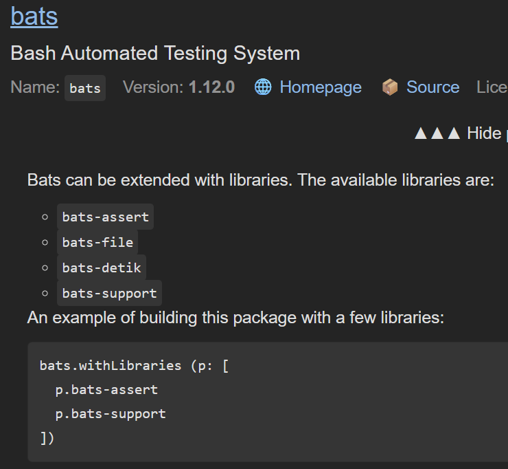

<!--
headingDivider: 1
-->
# nix pkgs のソースコードを探索する
### pkgs.bats.passthru.withLibraries
#### 無名関数、callPackages を学ぶ

ryu
2026/1/20
Nix 日本語コミュニティゼミ


# 自己紹介: ryu

<!--
header: "Nix 日本語コミュニティゼミ"
footer: "2026/1/20 ryu(@ryu_trifolium)"
paginate: true
-->

- バックグラウンド:
  - 非 IT 系企業の社内 SE
  - エンジニア歴 2 年
  - Nix が好き
- GitHub: ryuryu333
- Zenn: trifolium


# ～前回までのあらすじ～
<!--
_class: lead
-->


# ことの始まり
- Bash シェルスクリプト のテストツール Bats を導入した
- ヘルパーライブラリ bats-assert 等だけ見つからない！


# pkgs.Bats のソースコードを見てみる

bats-assert を利用しているコードを発見

```
passthru.tests = { 
  # ...
  bats.withLibraries (p: [
    p.bats-support
    p.bats-assert
    p.bats-file
    p.bats-detik
  ])
  # ...
```

# 使い方を真似てみる
- ビルドが通った！
- シェルスクリプトで load bats-asset も出来た

```
devShells.default = pkgs.mkShell {
    packages = with pkgs; [
        (bats.withLibraries (p: [
            p.bats-assert
            p.bats-support
        ]))
    ];
};
```

# めでたしめでたし？
<!--
_class: lead
-->


# 
## なんでこれで動くのか気になりますよね？
## →ソースコードを読んでみる

リンク：[nixpkgs/pkgs/by-name/ba/bats/package.nix](https://github.com/NixOS/nixpkgs/blob/nixos-unstable/pkgs/by-name/ba/bats/package.nix)

<!--
_class: lead
-->


# bats.withLibraries を探す

<small>

```
  passthru.withLibraries =
    selector:
    symlinkJoin {
      name = "bats-with-libraries-${bats.version}";
      paths = [
        bats
      ]
      ++ selector bats.libraries;
      nativeBuildInputs = [
        makeWrapper
      ];
      postBuild = ''
        wrapProgram "$out/bin/bats" \
          --suffix BATS_LIB_PATH : "$out/share/bats"
      '';
    };
```

</small>


# 前回勉強した内容
- passthru
  - 関数を定義できる（`passthru.tests`, `passthru.updateScript` ...）
- symlinkJoin
  - 複数の derivation を一つの derivation に配置
- wrapProgram
  - ラッパー経由でコマンドを実行（`bats` → `.bats-wrapped`）

bats / bats-assert を同じフォルダに配置し、ラッパー内で`BATS_LIB_PATH` を定義する仕組みを、`passthru.withLibraries` で定義


# 今日話すこと
### `passthru.withLibraries` の仕組みは分かった！
### どうやって使えばいい？
<!--
_class: lead
-->


# 今日話すこと
### ❌ 使用例からコピペすればヨシッ！
## ↓
### `passthru.withLibraries` の定義から導いていきます
<!--
_class: lead
-->


# Nix における関数

- `<関数名> = <引数>: <式>` で定義
- `<関数名> <引数>` で利用

```
nix-repl> double = x: x*2
nix-repl> double 3
6
```

参考資料: [Nix Pills ch5: Functions and Imports](https://nixos.org/guides/nix-pills/05-functions-and-imports.html)


# 関数 `withLibraries` の引数と式

- `selector` が引数
- `symlinkJoin { ... }` が式（呼び出し時の返り値）

```
  passthru.withLibraries =
    selector:
    symlinkJoin {
      # ...
    }
```


# 引数 `selector`
`selector` は `bats.libraries` を引数として受け取っている
→ 関数として利用されている

```nix
symlinkJoin {
    # ...
    paths = [
        bats
    ]
    ++ selector bats.libraries;
    # ...
```


# `bats.libraries` とは？
- passthru.libraries で定義された関数

(正確には引数が無いので、値（Attribute Set）を参照してるだけ
と言った方がいいかも)

```
passthru.libraries =
  callPackages ./libraries.nix { };
```

`callPackages` に `./libraries.nix { }` を渡した結果が返される

# libraries.nix
- 引数に `lib` 等を受け取る
- 返り値は `bats-assert` や `bats-support` のデリベーションの集合体

```
{ lib, stdenv, fetchFromGitHub, }:
{
  bats-assert = stdenv.mkDerivation (finalAttrs: {
    pname = "bats-assert";
    version = "2.1.0";
    src = fetchFromGitHub {
    # ...
  bats-support = stdenv.mkDerivation (finalAttrs: {
    # ...
```


# callPackages とは
- `import` の便利版（大雑把なイメージ）
- `lib` 等の引数を自動で渡してくれる

```
import ./libraries.nix {
  inherit lib stdenv fetchFromGitHub;
};

callPackages ./libraries.nix { };
```

# callPackages と import
`pkgs/by-name/ba/bats/package.nix` の `passthru.libraries` 
にて callPackages を import に置き換える
当然のごとくエラー発生

```nix
# passthru.libraries = callPackages ./libraries.nix { };
passthru.libraries = import ./libraries.nix { };
```

```bash
$ nix-build -E 'with import ./. {}; bats.withLibraries (p: [ p.bats-support p.bats-assert ])'
# error...
error: function 'anonymous lambda' called without required argument 'lib'
```


# callPackages と import
import で書く場合、引数を手動で指定しれば動く

```nix
# passthru.libraries = callPackages ./libraries.nix { };
passthru.libraries = import ./libraries.nix {
  inherit lib stdenv fetchFromGitHub;
};
```

```bash
$ nix-build -E 'with import ./. {}; bats.withLibraries (p: [ p.bats-support p.bats-assert ])'
/nix/store/biv81q03l5jwip9nqb16hf44isziibdq-bats-with-libraries-1.12.0
```

callPackages だと書くのが楽！


# 関数 `selector` の引数
- `selector` は `bats.libraries` を引数として受け取っている
- `bats.libraries` は `bats-assert` 等のデリベーション
（＝各ツールのビルド手順をまとめたもの）

```nix
symlinkJoin {
    paths = [
        bats
    ]
    ++ selector bats.libraries;
```


# 関数 `selector` の返り値
リストと結合 `[] ++` されるので、リストが返り値
→ `bats-assert` 等のデリベーションのリストが返り値

```nix
symlinkJoin {
    paths = [
        bats
    ]
    ++ selector bats.libraries;
```


# 関数 `withLibraries` の引数と返り値

- `selector` が引数
  - 引数: `bats-assert` 等のデリベーションの集合体
  - 返り値: `bats-assert` 等のデリベーションのリスト
- `symlinkJoin { ... }` が返り値
  - `bats` と `bats-assert` 等のデリベーションを
一つのデリベーションにまとめたモノ

```
  passthru.withLibraries =
    selector:
    symlinkJoin { ... }
```


# 呼び出し方を考える
- `withLibraries` の引数は関数
  - 無名関数を作成して渡す


# Nix における無名関数
- `(<関数>)` と定義
  - ※ `<関数名> = <引数>: <式>` が通常の関数
- `(<引数>: <式>) <引数>` と利用

```
nix-repl> double = x: x*2
nix-repl> double 3
6
nix-repl> (x: x*2) 3
6
```


# 呼び出し方を考える
- `withLibraries` の引数は関数（`selector`）
  - 引数: `bats.libraries`（デリベーションの集合体）
  - 返り値: `bats-assert` 等のデリベーションのリスト

```
(bats.libraries: [ bats.libraries.bats-assert ])
```

`bats.libraries` を `p` に置き換える

```
(p: [ p.bats-assert ])
```

# 無事に利用例と同じ形が導けました
<!--
_class: lead
-->


# 今日の話は忘れても大丈夫です
#### （ドキュメントに利用例を足しました）



<!--
_class: lead
-->

# 終わり？
<!--
_class: lead
-->


# callPackages の定義が未確認
## → ソースコートを読んでいきます
<!--
_class: lead
-->


# callPackages とは
- `import` の便利版（大雑把なイメージ）
- `lib` 等の引数を自動で渡してくれる

```
import ./libraries.nix {
  inherit lib stdenv fetchFromGitHub;
};

callPackages ./libraries.nix { };
```


# callPackages の定義
- [nixpkgs/pkgs/top-level/splice.nix](https://github.com/NixOS/nixpkgs/blob/master/pkgs/top-level/splice.nix) に記述がある
- pkgs + pkgs.xorg の集合体を `lib.callPackagesWith` に渡している

```
packagesWithXorg =
  pkgs
  // removeAttrs pkgs.xorg [
    "callPackage"
    "newScope"
    "overrideScope"
    "packages"
  ];
pkgsForCall = if actuallySplice then splicedPackagesWithXorg else packagesWithXorg;
callPackages = lib.callPackagesWith pkgsForCall;
```

# callPackagesWith の定義
- [nixpkgs/lib/customisation.nix](https://github.com/NixOS/nixpkgs/blob/master/lib/customisation.nix) に記述がある
- 引数を 3 つ必要とする関数として定義されている（詳細は後述）

```
callPackageWith =
  autoArgs: fn: args:
  let
    f = if isFunction fn then fn else import fn;
    fargs = functionArgs f;
    allArgs = intersectAttrs fargs autoArgs // args;
  in
  makeOverridable f allArgs
```

# 呼び出しの整理
- `callPackages` に渡したのは `./libraries.nix { }`
  - 定義は `callPackages = lib.callPackagesWith pkgsForCall`
- → `lib.callPackagesWith pkgsForCall ./libraries.nix { }`
  - 定義は `lib.callPackageWith autoArgs: fn: args:`
- → `autoArgs` = `pkgsForCall`、`fn` = `./libraries.nix`、`args` = `{ }`

※ `pkgsForCall` は pkgs + pkgs.xorg の集合体


# callPackagesWith
`autoArgs` = `pkgsForCall`、`fn` = `./libraries.nix`、`args` = `{ }`

```
f = if isFunction fn then fn else import fn;
fargs = functionArgs f;

allArgs = intersectAttrs fargs autoArgs // args;
```

※ `intersectAttrs <マスク用セット> <データ元セット>` フィルター処理

`autoArgs`（= pkgs + pkgs.xorg）から `fn` の引数（`fargs`）
だけを絞り込んだ後、`args` をマージ


# callPackagesWith
`autoArgs` = `pkgsForCall`、`fn` = `./libraries.nix`、`args` = `{ }`

```
f = if isFunction fn then fn else import fn;
allArgs = intersectAttrs fargs autoArgs // args;
makeOverridable f allArgs
```

`fn` の引数の集合体である `allArgs` を `f`（= `fn`）に渡す


# Callpackage Design Pattern
これまでの話はこちらのチュートリアルに書かれている
Callpackage Design Pattern をより実践で使っている例と言えそう

参考資料: [Nix Pills ch13: Callpackage Design Pattern](https://nixos.org/guides/nix-pills/13-callpackage-design-pattern.html#callpackage-design-pattern)


# ご清聴ありがとうございました
<!--
_class: lead
-->

