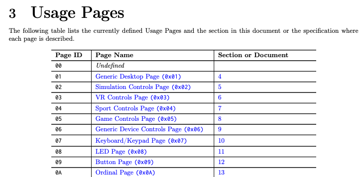
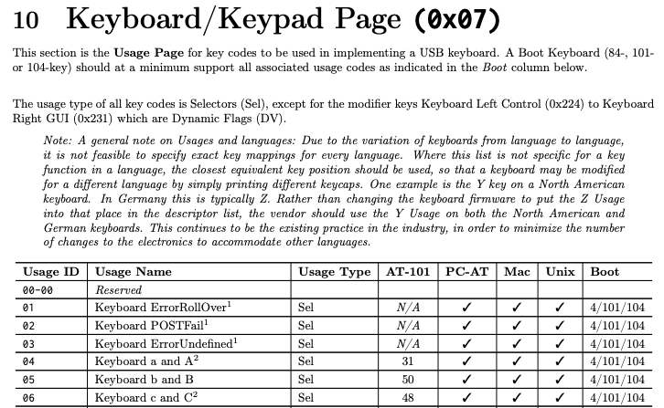

<!--
headingDivider: 1
-->
#
## nix-darwin 単独でキーマッピングを変更する
### Karabiner を使わずに宣言的記述で設定

ryu
2026/2/5
Nix 日本語コミュニティゼミ


# 自己紹介: ryu

<!--
header: "Nix 日本語コミュニティゼミ"
footer: "2026/2/5 ryu(@ryu_trifolium)"
paginate: true
-->

- バックグラウンド:
  - 非 IT 系企業の社内 SE
  - エンジニア歴 2 年
  - Nix が好き
- GitHub: ryuryu333
- Zenn: trifolium


#
## nix-darwin でキーマッピングを変更する方法

- [nix-darwin - system.keyboard.*](https://nix-darwin.github.io/nix-darwin/manual/#opt-system.keyboard.enableKeyMapping)
  - 単純な変更のみ、利用可能なオプションが少ない（5種）

```
nonUS.remapTilde、remapCapsLockToControl、remapCapsLockToEscape
swapLeftCommandAndLeftAlt、swapLeftCtrlAndFn
```

- [Karabiner-Elements](https://karabiner-elements.pqrs.org/)
  - 設定ファイル（`karabiner.json`）が別途必要
  - nix-darwin 単独で設定が完結しない


# 
<!--
_class: lead
-->
## nix-darwin で設定を完結させたい
## `system.keyboard.*` だと機能不足
## どうすればいいのか...
## ↓
## 取り敢えずソースコードを見てみよう


# それっぽい関数を発見

[nix-darwin/modules/system/keyboard.nix](https://github.com/nix-darwin/nix-darwin/blob/master/modules/system/keyboard.nix)

```
  options = {
    ...
    system.keyboard.userKeyMapping = mkOption {
      internal = true;
      type = types.listOf (types.attrsOf types.int);
      default = [];
      description = ''
        List of keyboard mappings to apply, for more information see
        <https://developer.apple.com/library/content/technotes/tn2450/_index.html>.
      '';
    };
  };
```


# 利用方法を探す - 1
- [リファレンス](https://nix-darwin.github.io/nix-darwin/manual/#opt-system.keyboard.enableKeyMapping)になぜか記載がない
- →ソースコードから利用例を観察する

```
  config = {
    ...
    system.keyboard.userKeyMapping = [
      (mkIf cfg.remapCapsLockToControl {
      HIDKeyboardModifierMappingSrc = 30064771129;
      HIDKeyboardModifierMappingDst = 30064771296; })
      ...
    ]
  };
```


# 利用方法を探す - 2
- description に書かれている[リンク](https://developer.apple.com/library/content/technotes/tn2450/_index.html)を見てみる
- → `hidutil` コマンドを利用した Remapping Keys のガイド

記載されていたコマンド例
```
hidutil property --set '{"UserKeyMapping":
[{"HIDKeyboardModifierMappingSrc":0x700000004,
"HIDKeyboardModifierMappingDst":0x700000005}]}'
```

# hidutil とは
- HID（Human Interface Device）デバイスのプロパティを
確認・変更するためのコマンドラインツール
- OS 標準の機能だけでキーの入れ替えが可能
- PC を再起動するとリセットされる

```
hidutil property --set '{"UserKeyMapping":
[{"HIDKeyboardModifierMappingSrc":0x700000004,
"HIDKeyboardModifierMappingDst":0x700000005}]}'
```


#
## system.keyboard.userKeyMapping
- OS 標準の仕組みである `hidutil` を利用してキーマッピングを
  変更する nix-darwin の設定
- 以下のようなリストを渡す
- Src のキーが Dst のキーとして扱われるようになる

```
({
HIDKeyboardModifierMappingSrc = 30064771129;
HIDKeyboardModifierMappingDst = 30064771296;
})
```


# 設定方法を探る
- `system.keyboard.swapLeftCommandAndLeftAlt` が true の場合
  Src = 30064771299、Dst = 30064771298 が指定されている

```
(mkIf cfg.swapLeftCommandAndLeftAlt {
  HIDKeyboardModifierMappingSrc = 30064771299;
  HIDKeyboardModifierMappingDst = 30064771298; })
```

- `hidutil` は 16 進数でキーを指定する
- `system.keyboard.userKeyMapping` では 10 進数になっている
  - 30064771299（10 進数） = 0x7000000E3（16 進数）


# 0x7000000E3 この値の意味
- The keys take a hexadecimal value that consists of 0x700000000 or’d with the desired keyboard usage value
  - [Remapping Keys in macOS 10.12 Sierra](https://developer.apple.com/library/archive/technotes/tn2450/_index.html) より
- → キーを表す数値が決まっている

|Usage|Usage ID (hex)|
|:---:|:---:|
|Keyboard a and A|0x04|
|Keyboard b and B|0x05|

<style>
table {
  margin-left: auto;
  margin-right: auto;
}
</style>

# 0x7000000E3 前半の数列の意味
- [HID（Human Interface Device）](https://www.usb.org/document-library/hid-usage-tables-17)にて
 デバイスとキーを一意に指定できる数列が定義されている
- 0x07 はキーボードを意味する




# 0x7000000E3 後半の数列の意味
- HID（Human Interface Device）にて
 デバイスとキーを一意に指定できる数列が定義されている
- 0xE3 は Keyboard Left GUI（Command キー）を意味する




# 0x7000000E3 この値の意味
- 前半がデバイスの種類
- 後半がキーの種類
- 組み合わせると、キーボードの Command キーという意味になる

```
0x07000 = Keyboard
0x000E3 = Left GUI Key

-> 0x07000000E3

-> 0x7000000E3
```


#
## system.keyboard.userKeyMapping
- 30064771299 = 0x7000000E3 = Keyboard Left GUI
- 30064771298 = 0x7000000E2 = Keyboard Left Alt
  - Command を Alt に変えるという設定と合致している

```
(mkIf cfg.swapLeftCommandAndLeftAlt {
  HIDKeyboardModifierMappingSrc = 30064771299;
  HIDKeyboardModifierMappingDst = 30064771298; })
```


# configuration.nix での使い方

```
  system.keyboard = {
    enableKeyMapping = true;
    userKeyMapping = [
      # Command -> Alt
      {HIDKeyboardModifierMappingSrc = 30064771299;
      HIDKeyboardModifierMappingDst = 30064771298;}
      # Alt -> Command
      {HIDKeyboardModifierMappingSrc = 30064771298;
      HIDKeyboardModifierMappingDst = 30064771299;}
    ];
    
    # この設定と同じ結果になる
    # swapLeftCommandAndLeftAlt = true;
  };
```


# 何ができるようになったのか？
- before
  - `system.keyboard.*` に用意されたマッピング変更しか使えない
- after
  - キーとキーの交換なら自由に設定できる
  - サードパーティ製ツール不要（OS 標準機能）

※複雑なマッピングは不可
　（単押しは Ctrl、長押しは Command、といった設定など）


# 特殊なキーについて
- Fn（Globe）キーは Apple 独自のキー
- 定義が特殊（Vendor-defined）
- 0xFF00000003：left Fn
- 0xFF0100000003：right Fn

公式情報は見つからず
[What is the hex ID for Fn key](https://apple.stackexchange.com/questions/340607/what-is-the-hex-id-for-fn-key) スレッドに書かれていた値


# 活用例
- Caps Lock と Fn に変更
  - 日本語/英語 切り替えがスムーズ & 押しやすい

```
  system.keyboard = {
    enableKeyMapping = true;
    userKeyMapping = [
      {
        # Caps Lock キー -> Fn（Globe）キー
        HIDKeyboardModifierMappingSrc = 30064771129; # Caps Lock キー
        HIDKeyboardModifierMappingDst = 1095216660483; # Fn（Globe）キー
      }
    ];
  };
```


# 自作関数で可読性を確保する

<small>

```
    userKeyMapping =
      let
        mkKeyMapping =
          let
            hexToInt = s: pkgs.lib.trivial.fromHexString s;
          in
          src: dst: {
            HIDKeyboardModifierMappingSrc = hexToInt src;
            HIDKeyboardModifierMappingDst = hexToInt dst;
          };
        capsLock = "0x700000039";
        fnKey = "0xFF00000003";
      in
      [
        # Caps Lock -> Fn
        (mkKeyMapping capsLock fnKey)
      ];
```

</small>


# 自分の設定
- Windows ライクなマッピングにしています

```
        leftControl = "0x7000000E0";
        leftCommand = "0x7000000E3";
        capsLock = "0x700000039";
        fnKey = "0xFF00000003";
      in
      [
        # Left Control <-> GUI(Command)
        (mkKeyMapping leftControl leftCommand)
        (mkKeyMapping leftCommand leftControl)
        # Caps Lock -> Fn
        (mkKeyMapping capsLock fnKey)
      ];
```


# 詳細は記事にまとめています

https://zenn.dev/trifolium/articles/a6fc32a05be6d0


# 今日話さなかったこと
- なぜ `hidutil` によるマッピング設定が再起動でも失われないのか
  - `hidutil` による変更は再起動でリセットされる

答えの頭出し
- nix-darwin の `system.activationScripts` にて
  様々な設定を行うシェルスクリプトが定義されている
- nix-darwin が `/Library/LaunchDaemons` に
  `org.nixos.activate-system.plist` を配置している
- 再起動時に設定用シェルスクリプトが自動実行される


# 注意
`system.keyboard.userKeyMapping` は `internal = true;` となっています
おそらく、公式の意図は「内部利用の関数扱い」だと思われます
（＝ユーザーが直接利用しない想定）

利用は自己責任でお願いいたします


# ご清聴ありがとうございました
<!--
_class: lead
-->

