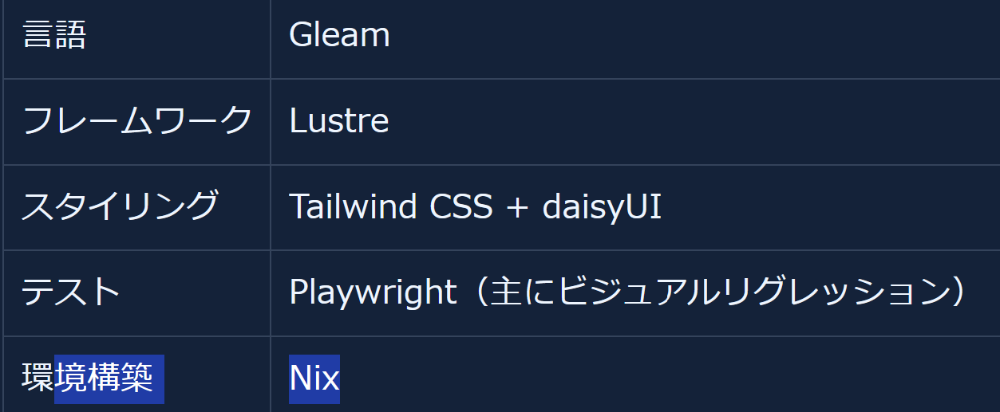
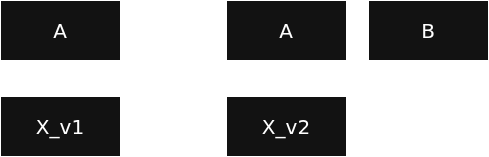
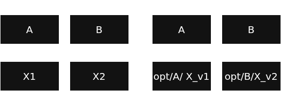
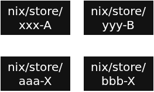
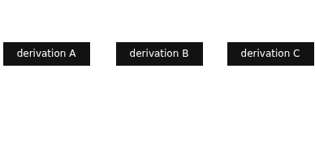
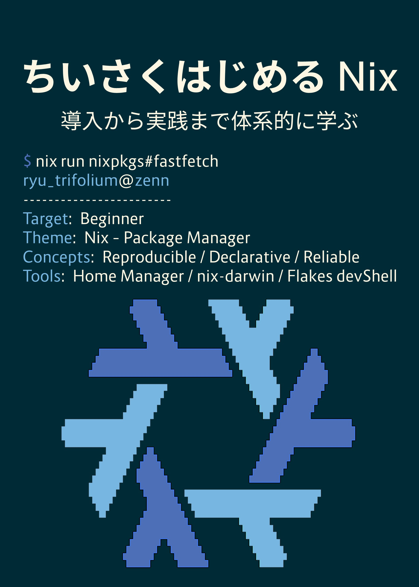

<!--
headingDivider: 1
-->

# パッケージマネージャー Nix はなぜ<br>純粋関数型言語で設定を記述するのか


ryu
2026/7/12
関数型まつり2026


# 自己紹介: ryu

<!--
header: "関数型まつり2026"
footer: "2026/7/12 ryu(@ryu_trifolium)"
paginate: true
-->

- 使用言語：C#、Python
  - 最近は F# にハマっている
  書きやすくて良き
- IaC が好き
  - PC 設定、ユーザー/開発環境
Nix で宣言管理している


# 
## パッケージマネージャーの話？
## 関数型言語と無関係なのでは？
<br>

## →関係あります<br>　Nix では、パッケージや環境の設定を<br>　純粋関数型言語である Nix 言語で行います

<!--
_class: lead
-->

#
## JSON や YAML でよくない？
## なぜ純粋関数型言語を使うんだ？

<br>

## →関数型の考え方で設計されたパッケージ管理<br>　のモデルを扱うのに<br>　関数型言語の特徴が適しているから

<!--
_class: lead
-->


#
## 関数型の考え方で設計されたパッケージ管理
## ってどんな仕組みなの？

<br>

## →今日のセッションで紐解いていきます
<!--
_class: lead
-->


# 今日話すこと
## ・従来のパッケージ管理の課題と Nix の解決策
## ・Nix のビルドモデルと関数型の考え方
## ・Nix 言語で設定を記述する理由/利点


# Nix とは
- 純粋関数型のパッケージマネージャー
- Linux、WSL、macOS で使える
- 約 11 万パッケージが利用可能
  - 参考値：Debian+derivs (Raspbian Testing) 45,266
   [repology.org 2026/7/4 時点](https://repology.org/)
- 特徴
  - 高い再現性
  - 宣言的な設定
  - 安全な更新・ロールバック


# 余談
#### 関数型まつりの WEB サイトの開発環境構築に
#### Nix が使われている <small>[参考：運営 Zenn 記事](https://zenn.dev/y047aka/articles/fp-matsuri_2026_recruiting)</small>




# Nix のユニークな特徴
- パッケージを「バージョン」だけではなく「**作り方込み**」で管理

```
$ which git
/nix/store/4qhdhmi7pzgad0zfd7c5lsg235mbf9hv-git-2.51.2/bin/git
```

### `<hash>-<name>` と名前を付け
### パッケージを `nix/store/...` に配置している

※`<hash>` は「作り方」を識別する値


# Nix のパッケージ管理
- 異なるバージョンが共存できる
  - `nix/store/xxx-curl-8.17`
  - `nix/store/yyy-curl-8.18`
- 同じバージョンが複数存在し得る
  - `nix/store/aaa-curl-8.18`
  - `nix/store/bbb-curl-8.18`

→パッケージごとに異なる `curl` を依存に持てる
　作り方が違えば同じバージョンでも別物

#
### なぜ Nix はこのような管理をしているのでしょうか？

<br>

### Nix の仕組みの前に...
### 従来のパッケージマネージャーの課題を解説します

<!--
_class: lead
-->


# 依存関係地獄
A は X_v1、B は X_v2 を必要とする場合



B のために X を v2 へ更新すると、A が動かなくなる

<style scoped>
p {
  text-align: center;
}
</style>


# 依存関係地獄 - 一般的な対策
- パッケージ名を分けて、別パッケージとして扱う
- 保存場所を分け、実行時にパスを指定する

→共存はできるが、名前やパスを個別に調整する必要がある



<style scoped>
p {
  text-align: center;
}
</style>


# 依存関係地獄 - Nix での対策
- パッケージごとに以下の処理を Nix が行う
  - 作り方ごとに名前・保存場所を分ける
  - 参照先のパスの指定




<style scoped>
p {
  text-align: center;
}
</style>


# 共有ライブラリの依存解決
- 一般的な環境
  - 実行時にシステム共通の場所からライブラリを探す
  - ライブラリ X が置き換わると、A にも B にも影響する
- Nix
  - ビルド時に利用するライブラリのパスを決める
  - A と B が異なるライブラリ X を参照できる


# 実例：Nix で管理している curl

```
$ readlink -f $(which curl)
/nix/store/0rfz69vp1nl0q2hxzig20hc60sk72z62-curl-8.17.0-bin/bin/curl

$ ldd $(which curl)
    libidn2.so.0 => /nix/store/aaa-libidn2-2.3.8/lib/libidn2.so.0
    libssh2.so.1 => /nix/store/ccc-libssh2-1.11.1/lib/libssh2.so.1
    libpsl.so.5 => ...
```


#
### 依存先のパスをビルド時に指定するには<br>依存パッケージの保存先を事前に知る必要がある

<br>

### →ビルド前に保存先をどう決めているのか？<br>　Nix のビルドの仕組みを見ていきます

<!--
_class: lead
-->


# Nix のビルドの流れ
- 入力元、出力先、ビルド方法を `.drv`（derivation）に記録
- サンドボックス環境でビルド
- 事前に決めた出力先（`nix/store`）にビルド産物を配置


<style scoped>
p {
  text-align: center;
}
</style>


# derivation - 精密なビルドレシピ
- 入力
  - 依存パッケージ
  - ソースコード
- ビルド方法
  - ビルドスクリプト
  - シェル、環境変数
- 出力
  - ビルド産物の保存先（`nix/store/...`）


# サンドボックス環境
- derivation に定義されたデータ・パッケージを使ってビルドする
- 利用する shell や `ls` コマンド等は事前に定義が必要
- 原則、インターネットアクセス禁止

## →derivation に書いた入力だけで<br>　ビルドできる状態へ近づける


#
## サンドボックスで外部依存を減らしている

## しかし、パッケージビルドのためには<br>ソースのダウンロード処理は必須

<br>

## →必要な外部アクセスを専用の仕組みに隔離し<br>　影響範囲を管理している

<!--
_class: lead
-->


# 例：インターネットアクセス
- GitHub からソースコードを取得する場合

```
  version = "0.11.21";
  src = fetchFromGitHub {
    owner = "astral-sh";
    repo = "uv";
    tag = finalAttrs.version;
    hash = "sha256-2PhGJbgCSqOiDVv8ktVkAaADhPxvKp1/JqkNQspt2Pc=";
  };
```

- 取得元、期待される hash を「事前に」定義
- 期待するhashと、ダウンロードした内容の hash を照合


#
## 外部依存を管理して、再現性を高めている


<br>

## もし、derivation やビルド産物が<br>後から書き換えられたら？
## 依存先のパスを事前に決めても意味が無い

<!--
_class: lead
-->


# Nix Store - ビルド産物などの保管場所
ソースコード、derivation、ビルド産物などを管理

- それぞれ固有の Store Path で識別
- immutable
  - 作成後は変更されない
  - 変更が必要なら別の Store Path を作る


#
## derivation を用いたビルドを解説しました

<br>

## 抽象的な話が続いたので
## `zlib` をビルドする derivation を見てみます

<!--
_class: lead
-->


# zlib を作る derivation
ビルド産物の配置場所を記述している箇所をピックアップ

```
"aaa-zlib-1.3.2.drv": {
  "outputs": {
      "out": {
          "path": "xxx-zlib-1.3.2"
      },
```

outputs.out.path にビルド産物が置かれる

```
$ ls /nix/store/b2swxfi8srrbsafvh9iyyhd26mz9giwf-zlib-1.3.2
lib  share
```


# zlib を作る derivation
ビルド条件を記述している箇所をピックアップ

```
"aaa-zlib-1.3.2.drv": {
  "env": {
    "builder": "/nix/store/xxx-bash-static-5.3/bin/bash",
    "src": "/nix/store/yyy-zlib-1.3.2.tar.gz",
    "stdenv": "/nix/store/zzz-bootstrap-stage3-stdenv-linux",
```

- builder：ビルドを実行するシェル
- src：ソースコード
- stdenv：よく使われるパッケージをまとめた環境


# zlib を作る derivation
入力を記述している箇所をピックアップ

```
"aaa-zlib-1.3.2.drv": {
  "inputs": {
      "drvs": {
          "xyz-bash-static-5.3.drv": {
              "outputs": [
                  "out"
              ]
          },
```

`xyz-bash-static-5.3.drv` の `out` に定義されたパスを入力として指定
＝サンドボックス内で利用可能になる


# derivation で依存を表現している
- inputs.drvs
  - どのようにビルドされたパッケージを依存とするかを指定
    - 例：`xyz-bash-static-5.3.drv` を指定
- inputs.drvs.hoge-drv.outputs
  - derivation のどの output を使うかを指定
    - 例：`xyz-bash-static-5.3.drv` の `output` の `out` を指定
- env 等
  - output 内の何を使うかを具体的に指定
    - 例：builder として `nix/store/xxx-bash/bin/bash` を指定


# 依存を含むパッケージのビルドの流れ
- derivation の参照関係から、ビルドの順番が決まる
- 参照される derivation を先にビルドする



<style scoped>
p {
  text-align: center;
}
</style>


# 整理 - Nix のパッケージ管理
- derivation に入力・ビルド方法・出力先を記録
- sandbox と hash 検証で外部依存の影響を抑える
- ソース・derivation・ビルド産物を固有のStore Path で<br>管理し、変更しない
- derivation の参照関係で依存先とビルド順序を表現

## →何からどう作るかを固定し<br>　同じ結果を再現しやすくしている


#
## Nix は関数型の考え方で設計されている
## と冒頭で紹介しました

<br>

## →ここまで見てきた仕組みを<br>　関数型の言葉で捉え直してみましょう

<!--
_class: lead
-->


# ビルドを関数のように扱う
- 関数
  - 入力を受け取り、結果を返す
- Nix
  - derivation を入力としてビルドする
  - ビルド産物を出力する


### derivation に「何からどう作るか」をまとめ<br>ビルドの入力として扱う


# 参照透過性と Nix のビルド
- 参照透過性
  - 式をその評価結果で置き換えても、意味が変わらない
  - 純粋な関数では、同じ入力から同じ結果を得られる
- Nix
  - ビルド結果が derivation だけで決まる状態に近づける
  - サンドボックスなどで外部要因を減らしている

### ビルドを、参照透過性を持つ関数のように<br>扱える状態へ近づけている


# 副作用と Nix のビルド
- 副作用
  - 処理の外部にある状態を読み書きすること
  - ファイルの読み書き、インターネットアクセス等
- Nix
  - ソースの読み込みやビルド産物の書き込みは必要
  - サンドボックスで利用できる入力と書き込み先を制限
  - 外部アクセスは専用の仕組みに隔離し、hashで検証

### 副作用の影響範囲を分離・管理している


# 純粋関数のようなビルドモデル
- 純粋関数
  - 同じ入力から同じ結果を返し、外部に副作用を生じさせない
- Nix
  - derivation を入力、ビルド産物を出力として扱う
  - サンドボックスでファイルや環境変数の読み書き範囲を制限
  - 外部取得は結果を hash で固定

### ビルド処理が持つ副作用を分離・制限して<br>ビルドを純粋関数的なモデルに近づけている


# 不変性と Nix Store
- 関数型プログラミング
  - 一度作成した値を変更しない
  - 変更が必要なら新しい値を作る
- Nix
  - Nix Store 上のソース・derivation・ビルド産物を変更しない
  - 変更が必要なら別のStore Path を作る

## 値を上書きしないため<br>Store Path が指す内容は後から変わらない


# 関数合成と derivation の参照
- 関数合成
  - 関数の出力を別の関数の入力として使う
  - 小さな処理をつないで、大きな処理を作る
- Nix
  - derivation の output を別の derivation の input として使う
  - derivation をつなげて依存関係を持つ derivation を作る

## 例：bash の derivation の output を
## 　　zlib の derivation の input に指定する


# 関数型的なビルドモデルによる利点
- 固有の Store Path → バイナリキャッシュ
  - 同じ Store Pathがキャッシュにあれば、ビルドせず再利用
- derivationの参照グラフ → Garbage Collection
  - どこからも参照されていない Store Path を削除
- 不変性 → Atomic Upgrade・ロールバック
  - 既存環境を上書きせず、新しい環境を作ってから切り替える
  - 過去の環境も残るため切り戻せる


#
## ここまでが Nix 内部の仕組みの話

<br>

## derivation をどう作成しましょうか？
## 人が直接扱うのは大変そう...

<!--
_class: lead
-->


# 実際の derivation

```
"env": {
        "NIX_CFLAGS_COMPILE": "-static-libgcc",
        "__structuredAttrs": "",
        "buildInputs": "",
        "builder": "/nix/store/6pj37gbk9x89s9iidwj4xvkzhcnjihv8-bash-static-5.3/bin/bash",
        "cmakeFlags": "",
        "configureFlags": "--includedir=/02qcpld1y6xhs5gz9bchpxaw0xdhmsp5dv88lh25r2ss44kh8dxz/include --sharedlibdir=/1rz4g4znpzjwh1xymhjpm42vipw92pr73vdgl6xs1hycac8kf2n9/lib --libdir=/1rk3cgkqcvdsapdc35lyidbrifq4gkcl71652d7v3hm4gps1sqsv/lib --enable-shared",
        "configurePlatforms": "",
```

env の一部をそのままコピペすると、表示が豆粒サイズになる

env だけで 40 行以上、全体だと 103 行
（JSON で出力し、フォーマットした場合）

### →これを人間が管理するのは非現実的


# derivation 作成の DSL に欲しい要素
※ DSL：Domain Specific Language

- 設定ファイルが single source of truth になって欲しい<br>→同じ設定ファイルから同じ derivation が作られて欲しい

### こんな性質を持った言語とは...？


# Nix 言語
- derivation を作る DSL
- 純粋関数型言語
- 遅延評価
- 動的型付け

### 結果として、宣言的な設定記述
### （ビルド手順は書かず、必要な要素を列挙する）
### という特徴に繋がっています


# 補足：derivation 作成と純粋/不純
- derivation を作成する関数は「不純」関数
  - 引数：attribute set
  - 返り値：attribute set
  - 副作用：単一の derivation を`nix/store` に書き込む

### derivation 作成関数を不純の境界にする
### 使う引数の作成は純粋関数で行うイメージ

※attribute set：名前と値の組をまとめたデータ


# 補足の補足：具体的な定義

`nix/src/libexpr/primops
/derivation.nix` （[リンク](https://github.com/NixOS/nix/blob/master/src/libexpr/primops/derivation.nix)）に
`builtins.derivation` が定義されている

こんな感じの構造の attribute set が返り値になっている
Nix 言語上ではファイル書き込みは見えない、実際は C++ での処理があり、ラップしている

```
    name = outputName;
    value = commonAttrs // {
      outPath = strict.${outputName};
      drvPath = strict.drvPath;
      type = "derivation";
      inherit outputName;
```


# Nix 言語で設定を記述する利点（主観）
- 学習コスパ
  - Nix の仕組みから利用者の環境定義まで、同じ言語で扱える
  - Nix を基盤としたツールは Nix 言語で扱う事が多い
    - ドキュメントのみに依存せず、ソースコードを読める方が楽
- 設定の柔軟性
  - 自作関数や Utility 関数を使い、複雑な設定を抽象化できる


# 実例：関数型まつりのサイト開発環境
`2026.fp-matsuri.org
/flake.nix`（[リンク](https://github.com/fp-matsuri/2026.fp-matsuri.org/blob/main/flake.nix)）
セットアップが 2 コマンドで完成する

<small>

```
nix develop
npm install
```

Gleam や Node.js が入った環境
```
      mkShell {
        buildInputs = [
          rebar3
          erlang
          gleam
          nodejs_24
        ];
```

</small>


# 実例：F# を使う開発環境

使いたいパッケージ名を列挙するだけ
他の部分は定型的なコードなので、使いまわし可能

```
devShells.default = pkgs.mkShell {
  packages = with pkgs; [
    dotnetCorePackages.sdk_10_0
    go-task
    # その他、使いたいパッケージ
  ];
```


# 実例：複数 OS 用の定義を楽に作る
`x86_64-linux`、`aarch64-darwin` 用の環境を定義できる
この後ろに、先ほどの様なパッケージを列挙していくイメージ
```
let
  supportSystems = with flake-utils.lib.system; [
    x86_64-linux
    aarch64-darwin
  ];
in
flake-utils.lib.eachSystem supportSystems (
  system:
```

# 余談：Nix 言語のラッパー
- LazyNix（[リンク](https://github.com/shunsock/lazynix)）
  - YAML で開発環境を定義
  - YAML から `.nix` ファイルが生成される
- Devbox（[リンク](https://github.com/jetify-com/devbox)）
  - JSON で開発環境を定義
  - 内部では Nix を利用している
  - 多機能


# まとめ
- Nix はビルドを純粋関数のように扱える状態へ近づける
  - derivation、サンドボックス、Nix Store で入力と副作用を管理
- Nix 言語は、derivation を作るためのDSL
  - derivation へ渡す値を純粋な関数で組み立てる
- 純粋関数型言語を使う理由
  - 複雑な設定を抽象化しつつ、derivation を作るまでの計算を予測可能に保つ


# Nix 仕組みを更に知りたい方
- Nix入門（[リンク](https://zenn.dev/asa1984/books/nix-introduction)）
  - Zenn で無料公開されている本
  - 発表で省略した仕組みも多数あるので、ぜひ！
- 公式リファレンス（[リンク](https://nix.dev/manual/nix/2.34/)）
  - 最新リリース Nix 2.34 版 


# Nix を使ってみたい方
- Nix入門: ハンズオン編（[リンク](https://zenn.dev/asa1984/books/nix-hands-on)）
  - Zenn で無料公開されている本、Nix入門と筆者は同じ
  - Nix 言語の基礎、パッケージのビルド定義の作り方などが学べる
- home-manager（[リンク](https://github.com/nix-community/home-manager)）
  - Nix を使ってユーザー環境を宣言的管理するツール
  - Nix ユーザーなら必須級に便利
- nix-darwin（[リンク](https://github.com/nix-darwin/nix-darwin)）
  - Nix で Mac のシステム設定を管理するツール
  - Mac ＆ Nix ユーザーなら必須級に便利


# Nix を使ってみたい方（宣伝）
- ちいさくはじめる Nix（[リンク](https://zenn.dev/trifolium/books/1c0373f3570334)）
  - Zenn で無料公開
  - Nix、home-manager、nix-darwin を横断的に解説
  - 実際に使うには何をすればいいか？を中心に記述



<style scoped>
p {
  text-align: center;
}
</style>


# まとめ
- Nix はビルドを純粋関数のように扱える状態へ近づける
  - derivation、サンドボックス、Nix Store で入力と副作用を管理
- Nix 言語は、derivation を作るためのDSL
  - derivation へ渡す値を純粋な関数で組み立てる
- 純粋関数型言語を使う理由
  - 複雑な設定を抽象化しつつ、derivation を作るまでの計算を予測可能に保つ
